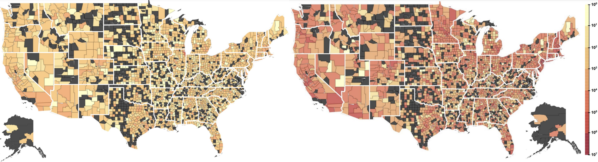

# 3DLNews2: A Three-decade Dataset of US Local News Articles

## 1. Overview 
We present 3DLNews2, an expanded version of the [3DLNews](https://github.com/wm-newslab/3DLNews), featuring significant enhancements and broader coverage:
- A collection of US local news articles spanning nearly three decades, from 1995 to 2024.
- Over 8 million URLs (including HTML text), with a refined subset of more than 4 million filtered news article URLs.
- Coverage of article URLs from over 14,000 local newspapers, TV stations, and radio broadcasters across all 50 states, offering a comprehensive view of the US local news landscape.
- Data gathered through an extended three-month long scraping of Google and Twitter search results, building on the original 3DLNews scraping methodology.
- A rigorous multi-step filtering pipeline was employed to exclude non-news links and enhance the dataset with rich metadata, such as: names and geographic coordinates of the source media organizations, article publication dates and other relevant metadata.
  
To cite, kindly use:

```
@inproceedings{ariyarathne_nwala_3dlnews,
  author    = {Gangani Ariyarathne and Alexander C. Nwala},
  title     = {3DLNews: A Three-decade Dataset of US Local News Articles},
  booktitle = {Proceedings of the 33rd ACM International Conference on Information and Knowledge Management (CIKM ’24)},
  year      = {2024},
  pages     = {1--5},
  location  = {Boise, ID, USA},
  publisher = {ACM},
  address   = {New York, NY, USA},
  doi       = {10.1145/3627673.3679165},
  url       = {https://doi.org/10.1145/3627673.3679165}
}
```



Fig 1. Article Distribution Across US Counties in 3DLNews version 1 (left) vs. 2 (right).

### 2. Accessing the Dataset

The dataset is publicly available for download via the following links. Please note that a Globus account is required to access the dataset. A Globus account can be easily created with your Google or ORCID iD accounts.
- [3DLNews2](https://app.globus.org/file-manager?origin_id=e524969c-7dff-474c-899c-efddf8d15b83&origin_path=%2F): Contains the dataset **excluding** the HTML files of articles. The paths to the HTML files are included in the preprocessed article data objects, which is detailed in the "[Data Enrichment](#33-data-enrichment)" section.
- [3DLNews2-HTML](https://app.globus.org/file-manager?origin_id=cbc9ee21-d7d3-4da6-ab27-d3f2360bdd79&origin_path=%2F): Includes the HTML files of the articles.

#### !!! Important Note
- The [3DLNews2](https://app.globus.org/file-manager?origin_id=e524969c-7dff-474c-899c-efddf8d15b83&origin_path=%2F) dataset (without HTML) is approximately 7 GB.
- The [3DLNews2-HTML](https://app.globus.org/file-manager?origin_id=cbc9ee21-d7d3-4da6-ab27-d3f2360bdd79&origin_path=%2F) (Only HTML files) dataset is approximately 247 GB.
  
Ensure that you have sufficient storage and bandwidth before downloading.

## 3. 3DLNews2 Dataset

### 3.1 Local news media dataset
We used an extended version of the [Local Memory Project](https://newsresearch.lab.wm.edu/tools/local-memory)'s (LMP) US local news dataset to get the local news media outlets. LMP's dataset consists of the websites of 5,993 local newspapers, 2,539 TV stations, and 1,061 radio stations, primarily extracted from [thepaperboy.com](thepaperboy.com) in 2016. We extended it by crawling and scraping [thepaperboy.com](thepaperboy.com) (again), [web.archive.org/web/20221203031956/http://www.usnpl.com/](web.archive.org/web/20221203031956/http://www.usnpl.com/), [50states.com](50states.com), and [einpresswire.com/world-media-directory/3/united-states](einpresswire.com/world-media-directory/3/united-states). Table 1 outline the number of local news media outlets that we have used to extract local news articles. The `broadcast` type refers to either TV or radio stations, because we could not accurately distinguish them during scraping.

The  improved local news media outlets dataset can be downloaded from here: [usa_2016_2024_pu5e.json.gz](https://github.com/wm-newslab/3DLNews/blob/main/resources/usa_2016_2024_pu5e.json.gz)

**Table 1:  US local news media dataset.**

| Media Type | Number of websites |
|------------|---------------------|
| Newspapers | 9,441               |
| Radio      | 2,449               |
| Broadcast  | 1,310               |
| TV         | 886                 |
| **Total**  | **14,086**          |

We issued Google and Twitter search queries to their respective search engines and scraped their links. For Google, we created queries from 1996 – 2024, for Twitter, 2006 – 2024. 

### 3.2 Data Filtering

The collected URLs from Google and Twitter scraping could include both news and non-news article links. We used [storysniffer](https://palewi.re/docs/storysniffer/index.html) for removing non-news article URLs from 3DLNews. Since there is no universal standard URL format for news articles, we have also provided access to the raw data, allowing researchers to implement their own filtering methods. 

Table 2 presents the number of links collected from Google and Twitter scrapping for all four media types and number of news articles after filtering.

**Table 2: 3DLNews: Number of news article URLs**

| **Media Type**    | **Google Collected** | **Google Filtered** | **Twitter Collected** | **Twitter Filtered** | **Total Collected** | **Total Filtered** |
|--------------------|-----------------------|-----------------------|------------------------|-----------------------|---------------------|--------------------|
| Newspapers         | 4,992,262            | 1,903,074            | 625,166               | 153,336               | 5,617,428          | 2,056,410         |
| Radio              | 1,069,333            | 183,735              | 119,202               | 7,534                | 1,188,535          | 191,269           |
| TV                 | 888,243              | 473,977              | 63,656                | 12,670               | 951,899            | 486,647           |
| Broadcast          | 837,599              | 420,664              | 74,350                | 15,256               | 911,949            | 435,920           |
| **Total**          | **7,787,437**        | **2,981,450**        | **882,374**           | **188,796**          | **8,669,811**      | **3,170,246**     |


### 3.3 Data Enrichment 

We enhanced the usefulness of the news article URLs in 3DLNews by adding attributes to each URL. Table 3 outlines the complete list of attributes. 

**Table 3: Properties of news article URLs in 3DLNews**

| Property          | Description | Example   |
|-------------------|------------------------|-------------------------|
| id              | A unique identifier for each URL | `cd9c1ca20a` |
| link              | The URL of the local news article.| `https://www.adn.com/alaska-news/article/womans-death-montana-has-eerie-echoes-yakutat-killing/2009/01/23/`                  |
| is_news_article      | Indicates whether the URL was classified as a news article using [StorySniffer](https://palewi.re/docs/storysniffer/index.html).                                                                                                                | true        |
| publication_date  | The publication date of the article. This was extracted using [html_date](https://htmldate.readthedocs.io/en/latest/) Note: While the year may appear in the URL path, this value reflects the actual publication date extracted from the article content.   | `2009-11-18`                                          |
| title             | Title of the article. | `Woman's death in Montana has eerie echoes of Yakutat killing - Anchorage Daily News`  |
| content             | The full textual content of the article. | <details><summary>content</summary><pre>To this day some guests refuse to sleep in Room 10 at the Glacier Bear Lodge in Yakutat. Sandra Perry, a vacationing mother of three from Washington, was shot to death there in the summer of 1996. She was 38. Her boyfriend, Robert Kowalski, said he grabbed a gun to shoot a bear outside their window but it accidentally went off, hitting her in the face. There were no witnesses. Troopers investigated and in the end they called it an accident. But around town people still talk about it, said Sharesse Edwards, one of the lodge owners. Some say Perry's spirit stayed in the room, unable to rest until the world knew the truth. And now, 12 years after her death, Alaska prosecutors are looking into the case again. That's because Kowalski has been charged with murder in Montana, and the circumstances are strikingly similar. MONTANA KILLING It was March of 2008 when Kowalski and his girlfriend, Lorraine Kay Morin, got into an argument after both had been drinking in the Northwest Montana town of Columbia Falls, according to accounts in the local paper, the Daily Inter Lake. Morin tried to throw Kowalski out and their fight escalated. A small-caliber handgun changed hands several times. Kowalski got hold of it and shot Morin in the face from a distance of about 12 inches, the Daily Inter Lake reported.</pre></details> |
| html_filename     | Filename with HTML content of the article.    | `HTML/AK/2009/3e21b4e350560f922993604b9a037793.html.gz`|
| media_name        | Name of local media organization.    | `Alaska Dispatch News`                                       |
| media_type        | Type of media source (*Newspaper* or *TV* or *Radio station* or *Broadcast*). "Broadcast" refers to either TV or radio stations.                           | `newspaper`                                           |
| location          | Location of the media organization. This includes: US state, city, & latitude/longitude.  | <details><summary>location</summary><pre>{"state": "Alaska", "city": "Anchorage", "longitude": -149.87828, "latitude": 61.216799}</pre></details>  |
| media_metadata    | More information about the news media. | <details><summary>media_metadata</summary><pre>{"video": "https://www.youtube.com/user/AlaskaDispatch", "twitter": "http://www.twitter.com/adndotcom", "media-class": "newspaper", "extracted-from": "usnpl.com, thepaperboy.com", "city-county-long": -149.87828, "media-subclass": "city-county", "website": "http://www.adn.com/", "facebook": "https://www.facebook.com/akdispatch", "city-county-lat": 61.216799, "name": "Alaska Dispatch News", "open-search": [], "city-county-name": "Anchorage", "rss": [], "us-state": "Alaska", "wikipedia": "https://en.wikipedia.org/wiki/Anchorage_Daily_News", "instagram": "https://www.instagram.com/alaskadispatch/", "youtube": "https://www.youtube.com/user/AlaskaDispatch"}</pre></details>        |
| source            | Platform (Google or Twitter) where the news article was extracted from.   | `Google`    |
| source_metadata   | More information about the platform scraped.  | <details><summary>source_metadata</summary><pre>{"http://www.adn.com/": {"source": "Google", "query": "news", "extra_params": {"raw_request_params": {"directives": "site:http://www.adn.com/", "search_query_params": "tbs=cdr%3A1%2Ccd_min%3A1%2F1%2F2009%2Ccd_max%3A12%2F31%2F2009", "no_interleave": false, "sleep_sec": 1.5, "files": false, "max_file_depth": 1, "news": false, "find_uri_key": "", "interleave_queries_params": {"count": 1, "news": false, "leave_browser_open": false}, "leave_browser_open": true, "mimic_human_search": false, "chromedriver_path": "", "chromedriver": null, "delay_sec": 0, "html_cache_file": "", "sniff_serp": false}}, "page_details": media_metadata{"result_count": 318, "search_location": {}, "knowledge_panel": {}, "search_state": {"proc_pg_count": 1}, "scraping_report": {"tag": "body", "children": [{"tag": "a", "count": 32, "children": [{"status": "get_title_link() returned empty because: Link has no text (see text: Skip to main content), so likely not SERP link OR href is blank, see href: \"\". Snippet: "}, {"status": "get_title_link() returned empty because: Google native link, see: \"https://support.google.com/websearch/answer/181196?hl=en\". Snippet: "}, {"status": "get_title_link() returned empty because: Link has no text (see text: Accessibility feedback), so likely not SERP link OR href is blank, see href: \"\". Snippet: "}, {"status": "get_title_link() returned empty because: Link has no text (see text: ), so likely not SERP link OR href is blank, see href: \"https://www.google.com/webhp?hl=en&sa=X&ved=0ahUKEwj1_8q27JKEAxUcGFkFHf0HBX0QPAgJ\". Snippet: "}, {"status": "get_title_link() returned empty because: Google native link, see: \"/search?sca_esv=322b65d8a49316d7\". Snippet: "}, {"status": "get_title_link() returned empty because: Link has no text (see text: Try again), so likely not SERP link OR href is blank, see href: \"\". Snippet: "}, {"status": "get_title_link() returned empty because: Link has no text (see text: ), so likely not SERP link OR href is blank, see href: \"\". Snippet: "}], "messages": []}], "count": 0, "misc": {}}, "sniffed_info": {}, "related_questions": [], "related_queries": [], "captcha_on": false}, "self_uris": [{"page": 1, "uri": "https://www.google.com/search?tbs=cdr%3A1%2Ccd_min%3A1%2F1%2F2009%2Ccd_max%3A12%2F31%2F2009&q=news%20site:http://www.adn.com/"}], "max_page": 1, "gen_timestamp": "2024-02-04T23:33:47Z", "links": [{"link": "http://www.adn.com/", "title": "here", "date": "Feb 04, 2024", "snippet": "", "rank": 0, "page": 1, "custom": {"link_class": "main_blue_link", "date_auto_gen": false, "children": []}}, {"link": "#", "title": "Turn off continuous scrolling", "date": "Feb 04, 2024", "snippet": "", "rank": 1, "page": 1, "custom": {"link_class": "main_blue_link", "date_auto_gen": false, "children": []}}, {"link": "https://www.adn.com/author/bradford-h-tuck", "title": "Bradford Tuckadn.comhttps://www.adn.com \u203a author \u203a bradford-h-tuck", "date": "Feb 04, 2024", "snippet": "", "rank": 2, "page": 1, "custom": {"link_class": "main_blue_link", "date_auto_gen": false, "children": []}}, {"link": "https://www.adn.com/author/paulette-simpson/", "title": "Paulette_Simpsonadn.comhttps://www.adn.com \u203a author \u203a paulette-simpson", "date": "Feb 04, 2024", "snippet": "", "rank": 3, "page": 1, "custom": {"link_class": "main_blue_link", "date_auto_gen": false, "children": []}}, {"link": "https://www.adn.com/features/article/fourth-kind-pays-telling-big-fib/2009/11/12/", "title": "'The Fourth Kind' pays for telling a big fibadn.comhttps://www.adn.com \u203a features \u203a article \u203a 2009/11/12", "date": "Feb 04, 2024", "snippet": "", "rank": 4, "page": 1, "custom": {"link_class": "main_blue_link", "date_auto_gen": false, "children": []}}, {"link": "https://www.adn.com/alaska-news/article/two-persons-found-dead-recently-are-identified/2009/08/11/", "title": "Two persons found dead recently are identifiedadn.comhttps://www.adn.com \u203a alaska-news \u203a article \u203a 2009/08/11", "date": "Feb 04, 2024", "snippet": "", "rank": 5, "page": 1, "custom": {"link_class": "main_blue_link", "date_auto_gen": false, "children": []}}, {"link": "https://www.adn.com/alaska-news/article/allan-tesche-dead-60-remembered-political-fighter/2009/07/14/", "title": "Allan Tesche, dead at 60, remembered as political fighteradn.comhttps://www.adn.com \u203a alaska-news \u203a article \u203a 2009/07/14", "date": "Feb 04, 2024", "snippet": "", "rank": 6, "page": 1, "custom": {"link_class": "main_blue_link", "date_auto_gen": false, "children": []}}, {"link": "https://www.adn.com/alaska-news/article/police-captain-retires-shortly-after-accident/2009/04/04/", "title": "Police captain retires shortly after accidentadn.comhttps://www.adn.com \u203a alaska-news \u203a article \u203a 2009/04/04", "date": "Feb 04, 2024", "snippet": "", "rank": 7, "page": 1, "custom": {"link_class": "main_blue_link", "date_auto_gen": false, "children": []}}, {"link": "https://www.adn.com/economy/article/longtime-ktuu-newsman-loses-job/2009/02/03/", "title": "Longtime KTUU newsman loses jobadn.comhttps://www.adn.com \u203a economy \u203a article \u203a 2009/02/03", "date": "Feb 04, 2024", "snippet": "", "rank": 8, "page": 1, "custom": {"link_class": "main_blue_link", "date_auto_gen": false, "children": []}}, {"link": "https://www.adn.com/alaska-news/article/feds-charge-4-sex-traffic-kids-involved/2009/12/18/", "title": "Feds charge 4 for sex traffic; kids involvedadn.comhttps://www.adn.com \u203a alaska-news \u203a article \u203a 2009/12/18", "date": "Feb 04, 2024", "snippet": "", "rank": 9, "page": 1, "custom": {"link_class": "main_blue_link", "date_auto_gen": false, "children": []}}, {"link": "https://www.adn.com/alaska-news/article/body-found-matanuska-river-believed-palmer-teens/2009/08/27/", "title": "Body found in Matanuska River believed Palmer teen'sadn.comhttps://www.adn.com \u203a alaska-news \u203a article \u203a 2009/08/27", "date": "Feb 04, 2024", "snippet": "", "rank": 10, "page": 1, "custom": {"link_class": "main_blue_link", "date_auto_gen": false, "children": []}}, {"link": "https://www.adn.com/alaska-news/article/womans-death-montana-has-eerie-echoes-yakutat-killing/2009/01/23/", "title": "Woman's death in Montana has eerie echoes of Yakutat ...adn.comhttps://www.adn.com \u203a alaska-news \u203a article \u203a 2009/01/23", "date": "Feb 04, 2024", "snippet": "", "rank": 11, "page": 1, "custom": {"link_class": "main_blue_link", "date_auto_gen": false, "children": []}}], "stats": {"total_links": 12, "domain_dist": {"top_k_domain_link_count": 11, "col_frac": 0.9166666666666666, "top_k_domains": [["adn.com", 11]], "k": 0}}}}</pre></details>                              |
| response_code     | Response code returned following GET request of link.                                                                                                      | `200`                                                 |
| expanded_url      | Final target URL for links that redirect.                                                                                                                  | `None`          |


### 3.4 Data Format

- The structure of the dataset is as follows.
  - [3DLNews2](https://app.globus.org/file-manager?origin_id=e524969c-7dff-474c-899c-efddf8d15b83&origin_path=%2F)
  
  ```
  ├── Google
  │   ├── 1-Newspapers
  │   │   ├── state
  │   │   │   ├── AK
  │   |   │   |   ├── google_newspaper_AK_2006.jsonl.gz
  │   |   │   |   ├── google_newspaper_AK_2007.jsonl.gz
  │   |   │   |   ├── -------------------------------
  │   │   │   ├── --
  │   │   │   └── WY
  │   |   │       ├── google_newspaper_AK_2006.jsonl.gz
  │   |   │       ├── google_newspaper_AK_2007.jsonl.gz
  │   |   │       ├── -------------------------------
  │   │   ├── preprocessed_state
  │   │   │   ├── AK
  │   |   │   |   ├── preprocessed_google_newspaper_AK_2006.jsonl.gz
  │   |   │   |   ├── preprocessed_google_newspaper_AK_2007.jsonl.gz
  │   |   │   |   ├── -------------------------------
  │   │   │   ├── --
  │   │   │   └── WY
  │   |   │       ├── preprocessed_google_newspaper_AK_2006.jsonl.gz
  │   |   │       ├── preprocessed_google_newspaper_AK_2007.jsonl.gz
  │   |   │       ├── ------------------------------- 
  │   ├── 2-Radio
  │   ├── 3-TV
  │   └── 4-Broadcast
  └── Twitter
      ├── 1-Newspapers
      ├── 2-Radio
      ├── 3-TV
      └── 4-Broadcast
  ```

  - [3DLNews2-HTML](https://app.globus.org/file-manager?origin_id=cbc9ee21-d7d3-4da6-ab27-d3f2360bdd79&origin_path=%2F)

  ```
  ├── Google
  │   ├── 1-Newspapers
  │   │   ├── HTML
  │   │   │   ├── AK
  │   │   │   │   ├── 1996
  │   │   │   │   │   ├── 0106eb41fcb93351d3bba81a67ecf487.html.gz
  │   │   │   │   │   ├── 024b602f2a0c7edf53ee2a1b0228bfc5.html.gz
  │   │   │   │   │   ├── -------------------------------------  
  │   │   │   │   ├── ----
  │   │   │   │   └──2024
  │   │   │   │       ├── 0106eb41fcb93351d3bba81a67ecf487.html.gz
  │   │   │   │       ├── 024b602f2a0c7edf53ee2a1b0228bfc5.html.gz
  │   │   │   │       ├── -------------------------------------  
  │   ├── 2-Radio
  │   ├── 3-TV
  │   └── 4-Broadcast
  └── Twitter
      ├── 1-Newspapers
      ├── 2-Radio
      ├── 3-TV
      └── 4-Broadcast
  ```
    
The Google directory contains JSONL files with news article URLs extracted through scraping Google. Each JSONL file represents a collection of URLs and their associated metadata gathered from automated searches on Google.

Similarly, the Twitter directory holds JSONL files with news article URLs obtained via scraping Twitter. Each JSONL file includes URLs and metadata collected from tweets, providing a diverse set of news articles shared on Twitter.

For Twitter and Google directories, there are three main directories for each news media type. Inside each media type folder, the following main directories are included:

- **state:** Contains scraped data for each state for each year.
- **preprocessed_data:** Contains directories for each state. Within each state directory, there are jsonl.gz files for each year, which include data objects for each URL with metadata.
- **HTML:** Contains the HTML content for each article for each state for each year, named with the hash value of each article URL.

### 4. News Data Extraction
   
The news_extractor.py script can be used to extract filtered news article data from .jsonl.gz files (Google/Twitter) and saves them into a single CSV file per platform/media combination. It supports filtering by platform, media type, publication year, and selected metadata fields.

#### 4.1 Command-Line Arguments

| Argument         | Description                                                                                      | Default                                | Example                                                           |
|------------------|--------------------------------------------------------------------------------------------------|----------------------------------------|-------------------------------------------------------------------|
| `--base-dir`     | Root directory containing the `Google` and/or `Twitter` folders.                                |                | `--base_dir /path/to/data/3DLNews2`                              |
| `--platforms`    | List of platforms to include.                                                                   | `Google Twitter`                       | `--platforms Google Twitter`                                     |
| `--media-types`  | Media types to process. Valid values: `newspaper`, `radio`, `tv`, `broadcast`.                  | All media types                        | `--media_types newspaper radio tv broadcast`                     |
| `--years`        | Filter files by year (must be part of the filename).                                            | All years                              | `--years 2020 2021 2024`                                         |
| `--metadata`       | Metadata fields to extract from each article. `id` and `file_path` are always included.         | id and file_path | `--metadata title content publication_date link`     |

#### 4.2 Steps to Use

**Step 1: Download the Dataset**
  Download and extract the [3DLNews2](https://app.globus.org/file-manager?origin_id=e524969c-7dff-474c-899c-efddf8d15b83&origin_path=%2F) dataset to your local system.

**Step 2: Get the script**

Clone this repository or directly download the [extract_data.py](https://github.com/wm-newslab/3DLNews2/blob/main/src/extract_data/extract_data.py) script to your local setup.

**Step 3: Run the Script**

Run one of the following commands to extract news articles from the 3DLNews2 dataset, depending on your needs:

  - Option 1: Minimal Command 
    ```
    python extract_news_to_csv.py \
    --base_dir /path/to/data/3DLNews2 \
    --metadata link title content publication_date
    ```
  - Option 2: Full Command (with explicit filters)
    ```
    python extract_news_to_csv.py \
    --base-dir /path/to/data/3DLNews2 \
    --platforms Google Twitter \
    --media-types newspaper radio tv broadcast \
    --years 2020 2021 2024 \
    --metadata title content publication_date link
    ```

#### 4.3 Output Structure

  When the script runs successfully, it generates output in the `results/` directory as follows:
  
  ```
     results/
      ├── 1-Google/
      │   └── 1-Newspaper.csv
      │   └── 2-Radio.csv
      │   └── 3-TV.csv
      │   └── 4-Broadcast.csv    
      ├── 2-Twitter/
      │   └── 1-Newspaper.csv
      │   └── 2-Radio.csv
      │   └── 3-TV.csv
      │   └── 4-Broadcast.csv    
  ```

#### 4.5 Notes
  - Fields `id` and `file_path` are **always included** in the CSV output.
  - You can mix and match filters (--years, --media_types, etc.) depending on your use case.
  - If no filters are provided, all available articles will be processed.
  - This script expects the directory structure and filenames to follow the 3DLNews2 dataset format.
  - **This is just a sample utility to help you extract data. Feel free to customize or extend the code based on your specific research or project needs.**

### 5. Potential Applications of 3DLNews Dataset
- Exploring the Nationalization of Local News
- Media Bias Analysis
- Studying US Local News Deserts
- Community Understanding, Trend Analysis, and Prediction
